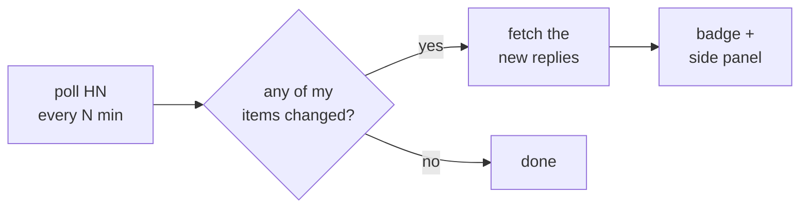
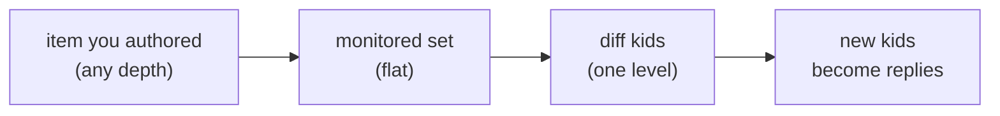

# HNswered

Chrome side panel that notifies you of replies to your Hacker News posts and comments.

https://github.com/user-attachments/assets/a577d57c-0c10-4f76-abf9-e51113befbbc

## How it works



One cheap "has anything changed?" request each tick. Full items are fetched only when something actually did. Two background scans catch late replies on older posts — daily over the past week, weekly over the past year.

The **refresh** button in the side panel bypasses the change-filter and re-checks every item from the last week directly. HN's `/v0/updates.json` is a narrow snapshot (≈50 items at a time), so a low-traffic post that just got its first reply can fall through the scheduled tick; refresh closes that gap at the cost of up to ~30 extra requests per click, all still rate-limited.

When you first set your HN username, existing top-level comments on your recent posts are surfaced as replies on the next tick, not silently baselined away. They drain at up to 10/tick (one item at a time) until caught up.

## Choosing a poll interval

Typical daily footprint against HN's API. Larger ticks trade freshness for fewer bytes.

| Poll every | Requests/day | Bytes/day | Fits |
|---|---:|---:|---|
| 1 min | ~2,800 | ~20 MB | near-real-time, very active threads |
| **5 min** (default) | ~600 | ~6 MB | balanced |
| 15 min | ~250 | ~3 MB | battery / data conscious |
| 30 min | ~150 | ~3 MB | low-activity account |
| 60 min | ~70 | ~1.5 MB | casual checker |

Numbers include the every-30-minute "deep sync" that refreshes your submission list. If the monitored user is very prolific (tens of thousands of comments), that single sync response can reach ~500 KB; typical is 5–10 KB.

## Retention

Controls how long **read** replies are kept. Unread replies are never auto-dropped.

| Retention | Typical footprint | Fits |
|---|---|---|
| 7 days | < 100 KB | only recent matters |
| **30 days** (default) | ~200 KB – 2 MB | most users |
| 90 days | ~1 – 5 MB | you revisit older threads |
| 365 days | ~2 – 8 MB | heavy archive use |

Two hard caps keep things safe regardless of your retention setting:

- **5,000 replies total.** Once exceeded, the oldest *read* replies are evicted first; unread replies are preserved. This is the real ceiling — at ~1–2 KB per reply, the cap alone keeps usage under ~10 MB.
- **Chrome's 10 MB `storage.local` quota.** We stay well below it in practice because of the above.

So "365 days" means *drop read replies past one year* — but if you accumulate enough replies before then, the 5,000-reply cap kicks in earlier and drops the oldest read first. Unread are always kept.

Current usage and a one-click "clear read replies" action live in **Settings → Storage**.

## Coverage

Depth in a thread is not a variable. Every item you've authored on HN — story, top-level comment, or a reply buried N levels deep — is a first-class entry in `user.submitted` and becomes a flat node in the monitored set. The poller only diffs each node's *direct* children; it never walks the tree up or down. A reply to your deepest leaf comment is detected identically to a top-level comment on your story.



## Install

The repo ships a pre-built `dist/`. No Node or build step required.


## Build (only if you're changing code)

```bash
pnpm install
pnpm build        # writes dist/
```

## Tests

```bash
pnpm test         # unit tests
pnpm type-check
```

Playwright-driven harnesses:

```bash
node scripts/snapshot.mjs     --label=<name>   # UI states at 360px + 990px
node scripts/perf-profile.mjs --label=<name>   # render cost per reply count
node scripts/impersonate.mjs  --label=<name>   # live-HN smoke test, request-budgeted
```

`impersonate` is a **read-only live integration smoke test against Hacker News** — every request is a `GET` to the public Firebase API, nothing is posted, commented, or written back to HN. `--demo=N` is a pipeline proof that doesn't require anyone to actually reply to you:

1. It fetches `/topstories.json` from HN and picks the top N real stories.
2. For each, it writes the story into the extension's `monitored` map with an empty `lastKids` baseline — effectively telling the extension *"pretend you are the OP of this story and have never seen any of its comments yet."*
3. It then forces a tick. The extension's real polling code fetches the story, diffs `[]` against the story's current `kids`, and treats every existing top-level comment as a new reply. Each commenter — the *comment OP* — surfaces in the side panel as someone who just replied to you.

Every request is real, every comment rendered is a real HN comment on a currently-trending thread. The only fiction is the extension's memory of having seen them before. A `--budget` flag caps total requests so the run can't accidentally pound HN.
