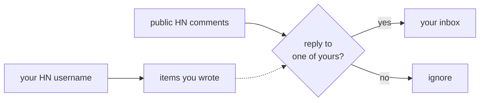

# HNswered

HNswered is a small Chrome side panel for Hacker News replies.

Set your HN username once. HNswered watches the public stories and comments you have authored, surfaces direct replies in a local inbox, and keeps an unread badge in the toolbar.

No HN login. No server. No write access. Just public HN data, matched locally.

https://github.com/user-attachments/assets/4cc4a1b6-39b7-4423-89a9-5f41e1b61153

## What It Does

- Finds replies to your HN stories and comments, even when the original comment is deep in a thread.
- Shows a clean side-panel inbox with unread/read filters.
- Lets you refresh on demand after posting something new.
- Catches up after Chrome has been asleep or closed.
- Keeps state local in Chrome storage.

## How It Works

One simple idea: every reply on HN points at its parent. HNswered remembers what you wrote and watches public comments for replies to those.



That's it. No login, no server, no backend you have to trust.

## Install

The repo ships a pre-built `dist/`. No Node or build step is required.


## Security

A self-contained security audit prompt is available at [docs/security-audit.md](docs/security-audit.md).

## For Contributors

Build from source (only needed if you change code — the repo ships a pre-built `dist/`):

```bash
pnpm install
pnpm build
pnpm test && pnpm type-check && pnpm harness:replay
```

Architecture notes, matching-strategy validation, and the local research harnesses live in [cost-analysis/docs/](cost-analysis/docs/).
