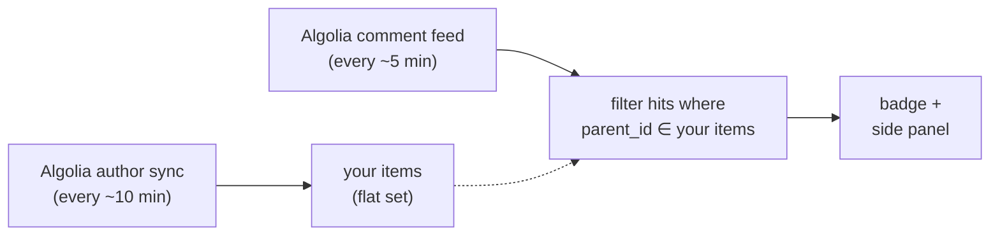
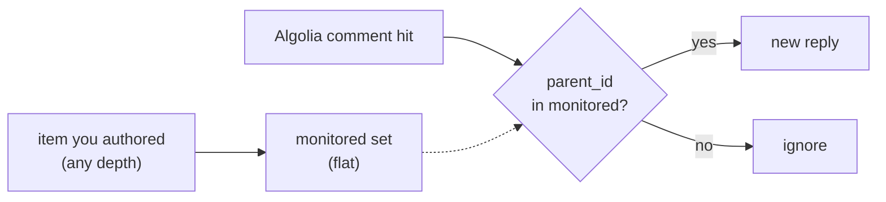

# HNswered

Chrome side panel that notifies you of replies to your Hacker News posts and comments.

https://github.com/user-attachments/assets/a577d57c-0c10-4f76-abf9-e51113befbbc

## How it works



One Algolia request (`search_by_date?tags=comment&numericFilters=created_at_i>…`) covers every new comment on HN within the overlap window — detection cost does **not** scale with how many items you monitor. A slower Algolia author-sync populates the monitored set as you post new items. A retrospective sweep of 19,819 parents confirmed Algolia's `parent_id` filter is effectively authoritative (99.99% live agreement against Firebase `kids[]` minus dead/deleted) — see [cost-analysis/docs/reports/report.md](cost-analysis/docs/reports/report.md).

The **refresh** button in the side panel runs both passes on demand, bypassing the author-sync cadence gate so a brand-new post lands in the monitored set immediately. Throttled at 10s between clicks.

When you first set your HN username, the author sync pulls your authored items from the last year; replies visible in the Algolia comment feed within the overlap window surface on the next tick.

## Choosing a poll interval

The Algolia comment feed is one request per tick regardless of how many items you have monitored — cost scales with cadence, not activity. Author-sync adds two requests (stories + comments) per sync cycle.

| Profile | Comment poll | Author sync | Requests/day | Median surface | p95 surface |
|---|---:|---:|---:|---:|---:|
| Minimum | 15m | 15m | 192 | 7.7m | 14.4m |
| **Balanced** (default) | 5m | 10m | 432 | 2.6m | 4.7m |
| Fast | 3m | 10m | 624 | 1.6m | 2.9m |
| Faster | 2m | 10m | 864 | 1.0m | 1.9m |
| Near-realtime | 1m | 2m | 2,160 | 0.5m | 0.9m |

Overlap window is pinned at 20 minutes — large enough that no reply ages out between author-sync cycles. See [cost-analysis/docs/design.md](cost-analysis/docs/design.md) for the full derivation.

## Retention

Controls how long **read** replies are kept. Unread replies are never auto-dropped. Pruning runs inside the author-sync cycle (~10 min).

| Retention | Typical footprint | Fits |
|---|---|---|
| 7 days | < 100 KB | only recent matters |
| **30 days** (default) | ~200 KB – 2 MB | most users |
| 90 days | ~1 – 5 MB | you revisit older threads |
| 365 days | ~2 – 8 MB | heavy archive use |

Two hard caps keep things safe regardless of your retention setting:

- **5,000 replies total.** Once exceeded, the oldest *read* replies are evicted first; unread replies are preserved. This is the real ceiling — at ~1–2 KB per reply, the cap alone keeps usage under ~10 MB.
- **Chrome's 10 MB `storage.local` quota.** We stay well below it in practice because of the above.

So "365 days" means *drop read replies past one year* — but if you accumulate enough replies before then, the 5,000-reply cap kicks in earlier and drops the oldest read first. Unread are always kept.

Current usage and a one-click "clear read replies" action live in **Settings → Storage**.

## Coverage

Depth in a thread is not a variable. Every item you've authored on HN — story, top-level comment, or a reply buried N levels deep — is a flat node in the monitored set. The poller filters Algolia comment hits by `parent_id ∈ monitored.keys()` — only *direct* descendants surface, never grandchildren. A reply to your deepest leaf comment is detected identically to a top-level comment on your story.



## Install

The repo ships a pre-built `dist/`. No Node or build step required.


## Build (only if you're changing code)

```bash
pnpm install
pnpm build        # writes dist/
```

## Tests

```bash
pnpm test              # unit tests
pnpm type-check
pnpm harness:replay    # deterministic tape replay
```

Playwright-driven harnesses:

```bash
node scripts/snapshot.mjs     --label=<name>   # UI states at 360px + 990px
node scripts/perf-profile.mjs --label=<name>   # render cost per reply count
node scripts/impersonate.mjs  --label=<name>   # live-HN smoke test, request-budgeted
```

`impersonate` is a **read-only live integration smoke test against Hacker News** — every request is a `GET` to the public Firebase or Algolia API, nothing is posted, commented, or written back to HN. `--demo=N` is a pipeline proof that doesn't require anyone to actually reply to you:

1. It fetches `/topstories.json` from HN and picks the top N real stories.
2. For each, it writes the story into the extension's `monitored` map — effectively telling the extension *"treat these stories as if you authored them."*
3. It then forces a refresh. The extension's real polling code issues one Algolia comment-feed request and filters to hits whose `parent_id` matches one of the seeded stories. Every recent direct comment on those trending stories surfaces in the side panel as if it were a reply to you.

Every request is real, every comment rendered is a real HN comment on a currently-trending thread. The only fiction is the claim that those stories are yours. A `--budget` flag caps total requests so the run can't accidentally pound HN or Algolia.
